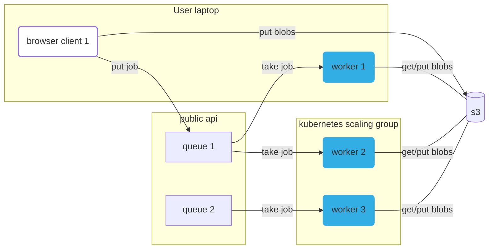

# Compute queues and the worker to run them all

Online docs: https://docs.metapage.io/docs/containers
[Online docs notion source](https://www.notion.so/metapages/Containers-182018579bb580c2bd76ed4b74eef1eb?pvs=4)

## High level commands:

- develop: `just dev`
- bump or set a new version and publish artifacts: `just deploy`
- test the entire project: `just test`

Finer commands are `just` in subdirectories.

## Overview

**Quick links:**

- `production api`: https://container.mtfm.io/
- `api deployment config`: https://dash.deno.com/projects/compute-queue-api
- [testing metapage](https://app.metapage.io/dion/development-testing-container-mtfm-io-4f4f5b4c0a064bb3a185e18414dddb7b?view=settings)

Run scientific workflow anywhere, reliably, via the browser. For compute heavy
jobs, use your own computer, or run on a cluster. Share compute. Run scientific
workflows no matter how old.

This repo is the docker compute queue. It reliably, conveniently, and
efficiently runs docker container jobs, using our infrastructure, or your own
(computers).

[Notion docs](https://www.notion.so/metapages/Arcadia-Astera-Compute-Cluster-Project-V2-3c7950a02bbe4eaa8389d62fd8439553?pvs=4)



## Local development

### Host requirements:

- `just`: https://just.systems/man/en/chapter_1.html
- `docker`: https://docs.docker.com/engine/install/
- `deno`: https://docs.deno.com/runtime/manual/getting_started/installation
- `mkcert`: https://github.com/FiloSottile/mkcert
  - ❗ 👉 Make sure you run `mkcert -install` ❗

Run the local stack:

```
just dev
```

Go to this
[Test metapage](https://app.metapage.io/dion/d31841d2c46d487b8b2d84795ab0f1b1?view=default)
to interact with a running simulation.

You might need to wait a bit to refresh the browser, it incorrectly returns a
`200` when there are no browser assets (yet). (This looks like a bug with the
hono webserver).

You can edit browser code, worker code, api code, and CLI and everything
automatically updates.

### Tests

- `just test`: runs the entire test suite, creating a new local stack
  - runs on every push to non-main branches
- `just app/test/watch`: (requires a running local stack) runs functional tests,
  currently only permissions
  - see `just api/test` for more test related commands

### Start each service separately

You can develop workers locally, pointing to prod or local API

```sh
  just app/worker/dev
  # or
  just worker dev

  just app/worker/prod
  # or
  just worker prod
```

You can develop the browser locally, pointing to prod or local API

```sh
  just app/browser/dev
  # or
  just browser dev

  just app/browser/prod
  # or
  just browser prod
```

### Submit jobs via the CLI

To the local stack:

```typescript
cd app/cli
deno run --unsafely-ignore-certificate-errors --location https://worker-metaframe.localhost --allow-all src/cli.ts job add local1 --file ../../README.md -c 'sh -c "cat /inputs/README.md > /outputs/readme-copied.md"' --wait
```

To the production stack:

```typescript
cd app/cli
deno run --allow-all src/cli.ts job add public1 --file ../../README.md -c 'sh -c "cat /inputs/README.md > /outputs/readme-copied.md"' --wait
```

The CLI tool has yet to be versioned and binaries built
https://github.com/metapages/compute-queues/issues/21

### Local development: cloud compute providers

E.g. kubernetes, nomad.

1. Run the local stack with `just dev`
2. Workers in the local worker cluster need to be able to reach (on the host):
   `https://worker-metaframe.localhost`
   1. Point the workers to a queue
3. Go to
   [this metapage](https://app.metapage.io/dion/d31841d2c46d487b8b2d84795ab0f1b1?view=default)
   1. You should see the docker runner at the bottom, change the slider to
      create compute jobs

## Deployment (automation)

**(public) api:**

- push to `main`:
  - The `api` server is deployed to
    [deno.deploy](https://dash.deno.com/projects/compute-queue-api)
    - The `browser` is built as part of the `api`

**worker:**

- git semver tag:
  - the `worker` image is built, published
    - TODO: https://github.com/metapages/compute-queues/issues/2
  - `worker` host requirements:
    - just [docker](https://docs.docker.com/engine/install/)
  - our cloud worker providers update the worker version and redeploy
    - TODO: https://github.com/metapages/compute-queues/issues/3

## Background

This service provides docker compute functions as metaframes.

This service provides an iframe, that allows users to configure running a
specific docker container (a **job**) on a specific **queue**. The iframed
browser window sends that job configuration to the server, the job is added to
the queue, then workers pick up the job, run it, and send the results back.

To run those docker containers, users can either rent compute from the metapage
platform, or run worker(s) themselves, either on their own personal
laptops/desktops, or on their own cluster infrastructure. Docker images can be
used directly, or a git repo can be given, and the docker image built directly.

This repo contains all the infrastructure for the queues, workers, and examples
of cloud providers managing the horizintal scaling worker fleets.
