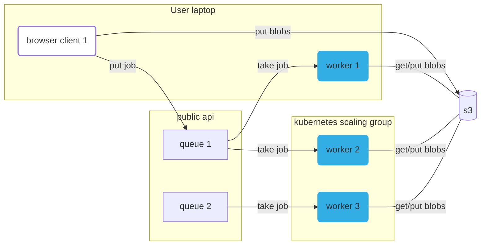

# Compute queues and the worker to run them all

**Quick links:**
 - `production api`: https://container.mtfm.io/
 - `api deployment config`: https://dash.deno.com/projects/compute-queue-api

Run scientific workflow anywhere, reliably, via the browser. For compute heavy jobs, use your own computer, or run on a cluster. Share compute. Run scientific workflows no matter how old.

[Notion docs](https://www.notion.so/metapages/Arcadia-Astera-Compute-Cluster-Project-V2-3c7950a02bbe4eaa8389d62fd8439553?pvs=4)



## Local development

### Quickstart

**Start the local dev stack (requires [just](https://github.com/casey/just?tab=readme-ov-file#installation)):**

```
  just dev
```

Go to this [Test metapage](https://app.metapage.io/dion/d31841d2c46d487b8b2d84795ab0f1b1?view=default) to interact with a running simulation.

You might need to wait a bit to refresh the browser, it incorrectly returns a `200` when there are no browser assets (yet). (This looks like a bug with the hono webserver).

You can edit browser code, worker code, and api code, and everything automatically updates.

### Start each service separately

You can develop workers locally, pointing to prod or local API

```
  just app/worker/dev

  just app/worker/dev-prod
```

You can develop the browser locally, pointing to prod or local API

```
  just app/browser/dev

  just app/browser/dev-prod
```

### Local development: host system prerequisites

 - [docker](https://docs.docker.com/engine/install/)
 - [just](https://github.com/casey/just?tab=readme-ov-file#installation)
 - [deno](https://docs.deno.com/runtime/manual/getting_started/installation)
 - [mkcert](https://github.com/FiloSottile/mkcert?tab=readme-ov-file#installation)

If you want to do browser development outside of docker compose, I assume you will know how to set up a local browser environment (`npm` etc).


### Local development: cloud compute providers

E.g. kubernetes, nomad.

1. Run the local stack with `just dev`
2. Workers in the local worker cluster need to be able to reach (on the host): `https://worker-metaframe.localhost`
   1. Point the workers to a queue
3. Go to [this metapage](https://app.metapage.io/dion/d31841d2c46d487b8b2d84795ab0f1b1?view=default)
   1. You should see the docker runner at the bottom, change the slider to create compute jobs


## Deployment (automation)

**(public) api:**

- push to `main`:
  - The `api` server is deployed to [deno.deploy](https://dash.deno.com/projects/compute-queue-api)
    - The `browser` is built as part of the `api`
        
**worker:**

- git semver tag:
  - the `worker` image is built, published
    - TODO: https://github.com/metapages/compute-queues/issues/2
  - `worker` host requirements:
    - just [docker](https://docs.docker.com/engine/install/)
  - our cloud worker providers update the worker version and redeploy
    - TODO: https://github.com/metapages/compute-queues/issues/3


## Background

This service provides docker compute functions as metaframes.

, as a metaframed service. 

This service provides an iframe, that allows users to configure running a specific docker container (a **job**) on a specific **queue**. The iframed browser window sends that job configuration to the server, the job is added to the queue, then workers pick up the job, run it, and send the results back.

To run those docker containers, users can either rent compute from the metapage platform, or run worker(s) themselves, either on their own personal laptops/desktops, or on their own cluster infrastructure. Docker images can be used directly, or a git repo can be given, and the docker image built directly.

This repo contains all the infrastructure for the queues, workers, and examples of cloud providers managing the horizintal scaling worker fleets.
