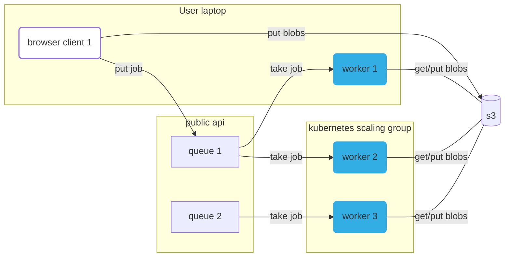

# Compute queues and the worker to run them all

[Notion docs](https://www.notion.so/metapages/Arcadia-Astera-Compute-Cluster-Project-V2-3c7950a02bbe4eaa8389d62fd8439553?pvs=4)



## Quickstart

**Start the dev stack:**

```
  just dev
```

You might need to wait a bit to refresh the browser, it incorrectly returns a `200` when there are no browser assets (yet). (This looks like a bug with the hono webserver).

You can edit browser code, worker code, and api code, and everything automatically updates.

## Deployment (automation)

  - push to `main`:
    - The `api` server is deployed to deno.deploy https://github.com/metapages/compute-queues/issues/1
      - The `browser` is built as part of the `api`
  - git version tag:
    - the `worker` image is built, published
    - our owned worker providers update the worker version and redeploy

## Automation


## Short description

Run scientific workflow anywhere, reliably, via the browser. For compute heavy jobs, use your own computer, or run on a cluster. Share compute. Run scientific workflows no matter how old.

## Longer description

Metapages require running docker containers, as a service. 

This service provides an iframe, that allows users to configure running a specific docker container (a **job**) on a specific **queue**. The iframed browser window sends that job configuration to the server, the job is added to the queue, then workers pick up the job, run it, and send the results back.

To run those docker containers, users can either rent compute from the metapage platform, or run worker(s) themselves, either on their own personal laptops/desktops, or on their own cluster infrastructure. Docker images can be used directly, or a git repo can be given, and the docker image built directly.

This repo contains all the infrastructure for the queues, workers, and examples of cloud providers managing the horizintal scaling worker fleets.
